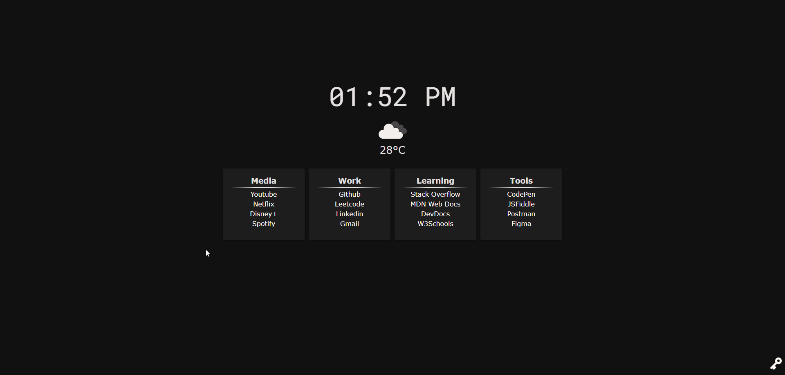

# Custom Start Page

this is a custom minimal start page made to replace the default chrome (or another browser) startpage.

# How do I set the startpage as my default?

I recommend using either of these 2 extensions:

Fast New Tab Redirect:\
https://chromewebstore.google.com/detail/fast-new-tab-redirect/ohnfdmfkceojnmepofncbddpdicdjcoi

New Tab Override:\
https://addons.mozilla.org/en-US/firefox/addon/new-tab-override/

# OpenWeatherMap Setup

**1. Create an API Key:**
- Visit the OpenWeatherMap API Keys page.
- Log in or create an account if you don't have one.
- Click on "Create Key" and name your key. This will generate an API key for you.

**2. Get Your API Key:**
- Once created, your API key will be displayed. Copy this key for later use.
  
**3. Configure the API Key:**
- Click on the key icon located at the bottom left of the homepage of your custom start page.
- Paste your copied API key into the input field that appears.
- Click the enter button to ensure the API key is stored and used for weather data retrieval.